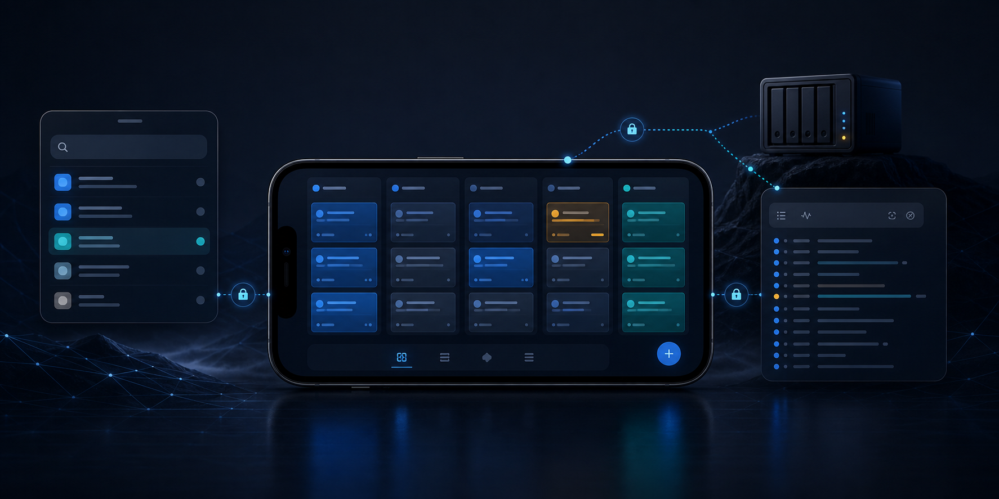
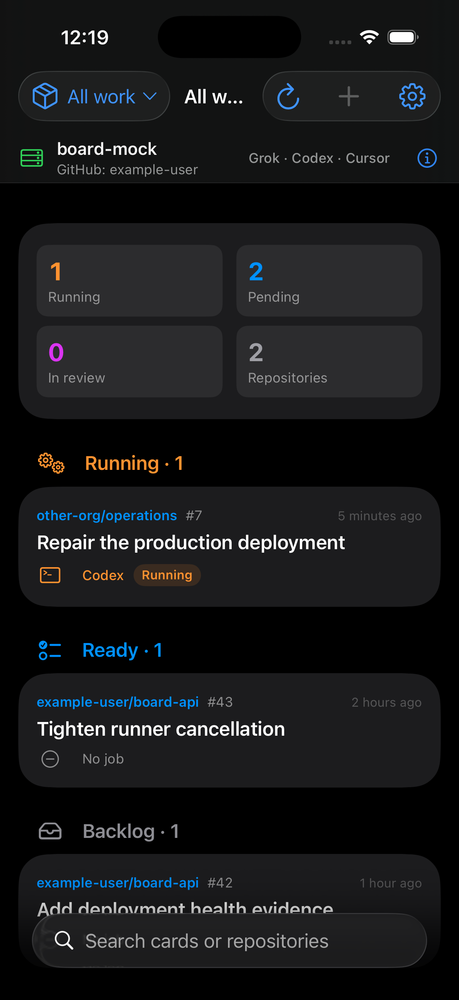

# Board



Board is a native SwiftUI client for [`board-api`](../board-api), a self-hosted Rust service for an Ubuntu guest or server. It presents GitHub issues as a five-column kanban and lets a phone start, follow, and cancel coding-harness jobs running safely on that host.

The app talks only to Board API over LAN or Tailscale. It does not contain a GitHub PAT, vendor token, embedded coding agent, or GitHub SDK. GitHub and vendor authentication stay on the server.



## What the app does

- Links to one self-hosted Board API with a short-lived pair code.
- Stores the returned `board_` token and server ID in Keychain.
- Opens on an All work view that combines labelled cards across every repository the server can push to.
- Groups running, pending, review, backlog, and done work so active projects are visible without guessing a repository.
- Shows repositories visible to the GitHub account signed in on the server, including other organisations and direct collaborations.
- Searches repository owner, name, and description locally as you type.
- Displays open GitHub issues in `backlog`, `ready`, `running`, `review`, and `done`.
- Creates cards and moves them with drag and drop or explicit move actions.
- Reads issue comments and posts follow-up notes from card detail.
- Moving a card to Ready asks an automation-enabled server to start it immediately.
- Starts `grok`, `codex`, or `cursor` jobs on the server, including an ordered sequential crew.
- Streams job logs and status with server-sent events and can cancel a running job.
- Shows whether a pull request actually exists; a completed job without one is marked unverified.
- Keeps both the all-repository overview and per-repository card lists on disk for offline reading.

The phone never clones a repository or executes a coding CLI. It is a focused remote control for the homelab service.

## Requirements

- macOS with Xcode 16 or newer.
- iOS 18 or newer for the app target.
- Swift 6.
- [XcodeGen](https://github.com/yonaskolb/XcodeGen) to regenerate `Board.xcodeproj` from `project.yml`.
- A reachable Board API for real data, or the built-in mock for UI work.

Board is iPhone-first and remains readable on iPad. It supports light and dark appearances, Dynamic Type, VoiceOver labels, swipe actions, drag and drop, and explicit movement controls.

## Open and run in Xcode

Install XcodeGen if it is not already available:

```sh
brew install xcodegen
```

Generate the checked-in Xcode project and open it:

```sh
git clone https://github.com/YOUR_GITHUB_OWNER/board-ios.git
cd board-ios
xcodegen generate
open Board.xcodeproj
```

In Xcode:

1. Select the `Board` scheme.
2. Choose an iOS 18 or newer simulator, or a signed iPhone target.
3. Press Run.
4. Enter a reachable Board API URL and pair code on first launch.

The project file is generated from [`project.yml`](project.yml). Change that specification and regenerate rather than hand-editing `Board.xcodeproj/project.pbxproj`.

## Run without a server

The deterministic mock implements the same client protocol and JSON models as the real client. To explore the complete UI without a running guest, edit the Board scheme's Run arguments and add:

```text
-board-ui-testing
-reset-state
```

The first flag selects `MockBoardAPIClient`. The second clears local launch state for a fresh pairing flow. These flags are intended for development and UI tests only; normal launches always use `BoardAPIClient`.

## Command-line build and tests

Build the app for a generic simulator:

```sh
DEVELOPER_DIR=/Applications/Xcode.app/Contents/Developer \
  xcodebuild build \
  -project Board.xcodeproj \
  -scheme Board \
  -configuration Debug \
  -destination 'generic/platform=iOS Simulator'
```

Run unit and UI tests on an installed simulator:

```sh
DEVELOPER_DIR=/Applications/Xcode.app/Contents/Developer \
  xcodebuild test \
  -project Board.xcodeproj \
  -scheme Board \
  -destination 'platform=iOS Simulator,name=iPhone 17 Pro'
```

If that device name is unavailable, list installed destinations with `xcrun simctl list devices available` and substitute one from the output.

## Link the Ubuntu server

On first launch:

1. Enter the LAN, Tailscale IP, or MagicDNS base URL.
2. Tap Test Connection. The app calls open route `GET /v1/health`.
3. Enter the current eight-character pair code from the guest.
4. Tap Pair. The app sends `POST /v1/pair` once.
5. Board stores the returned token and server ID in Keychain, then loads `GET /v1/server`.

Valid direct examples are:

```text
http://192.168.50.50:8787
http://100.100.100.100:8787
http://board.<tailnet>.ts.net:8787
```

When the server operator has explicitly configured Tailscale Serve, use its HTTPS URL with no port:

```text
https://board.<tailnet>.ts.net
```

Do not use `https://board.<tailnet>.ts.net:8787` for the default deployment. Port 8787 is the API's direct HTTP listener, while optional Tailscale Serve terminates HTTPS on the standard port.

### Pair-code QR

On a fresh server with no API keys, Board API prints both the pair code and a terminal QR in `/home/board/HOST.md` and journald. The QR contains the code only. The current app does not request camera access or include a QR scanner. You can scan the QR with the standard iPhone Camera, copy the resulting text, and paste it into Board's pair-code field.

After one client pairs, the server no longer prints a first-client code. Existing credentials should be kept. A rejected `401` clears the local token and returns the app to linking.

## Repository selection and search

Board opens with **All work** selected. This is the cross-repository queue returned by Board API 0.6.0. Every row shows its `owner/repository`, issue number, column, latest harness/job state, and a pull-request link when one was actually recorded. The summary at the top counts running, pending, review, and affected repositories. Cards are grouped in operational order: Running, Ready, Review, Backlog, then Done.

The repository button is now a filter, not a required first choice. Choose **All work** to return to the overview, or choose one repository for its five-column kanban. The sheet search is always visible and matches:

- `owner/repository`;
- repository name;
- organisation or owner name;
- repository description.

Filtering happens against the fetched list, so typing does not make one network request per character. The All work list has its own local search across repository, issue number, title, body, and labels. Private repositories have a lock indicator, and the selected filter has a checkmark.

The server obtains this list from the GitHub account authenticated as Linux user `board`. It includes repositories available through ownership, direct collaboration, and organisation membership. If an organisation is missing, fix the GitHub identity, token scopes, or organisation authorisation on the server. The app cannot expand server-side GitHub permissions.

## Cards and refresh behaviour

GitHub issues are the only cards. Board API maps these labels to the five columns:

| App column | GitHub label |
| --- | --- |
| Backlog | `board:backlog` |
| Ready | `board:ready` |
| Running | `board:running` |
| Review | `board:review` |
| Done | `board:done` |

The app calls `GET /v1/overview` immediately after linking or launching with saved credentials. The API searches all pushable repositories available to its GitHub identity, globally sorts labelled open issues by update time, and paginates one shared 60-second snapshot. This means running and pending work from personal repositories, other organisations, and direct collaborations is visible before you select a project. If one GitHub owner cannot be refreshed, the API lists it in `unavailableOwners`, retains its older cached cards when possible, and the app shows one compact inline warning. Cards from successful owners still load; no alert blocks the board.

Board refreshes the visible card list and jobs whenever iOS returns it to the active foreground. Pull-to-refresh runs through app-owned refresh work so SwiftUI cancelling its gesture task cannot turn a cancelled health probe into a false Offline state. Any cancelled request is discarded, not reported as an outage. Read-only requests retry once after a short delay when a timeout, dropped connection, temporary DNS failure, rate limit, or retryable server response occurs. If card refresh still fails, the app checks `/v1/health`: only a completed failed health check produces the orange Offline state and disables mutations. A healthy server with delayed GitHub data keeps mutations available and shows a non-blocking saved-data warning. Repository-list failures never hide or block All work.

The app reloads the visible view when linked, foregrounded, or when you use Refresh. It loads a single repository when that filter is selected. There is no timer-based polling in the iOS app. Overview pagination, concurrent app requests, and automatic Ready pickup share one server snapshot, preventing GitHub's search quota from being spent once per owner for every request. An issue created by Grokbot or another GitHub client appears after the next snapshot refresh when it is open and has one `board:*` column label.

Creating a card calls `POST /v1/cards`. Moving a card calls `PATCH /v1/cards/{number}` and updates the interface optimistically. If the request fails, the card rolls back to its previous column and an error is shown.

Card detail loads GitHub issue comments with `GET /v1/cards/{number}/comments` and posts a follow-up with `POST /v1/cards/{number}/comments`. The post is made by the GitHub identity authenticated on the server and is rejected unless that identity appears in `allowedIssueAuthors`. When Board builds a later job prompt, it includes only comments authored by users in that allowlist; other GitHub comments remain visible but cannot instruct the coding agent. Board-generated job-status comments are also excluded. The immutable issue-author check still applies independently before any job can run.

On Board API 0.4.0 or newer with `autoRun.enabled`, creating or moving a card to Ready starts a server job immediately only when its immutable GitHub issue author appears in the server's `allowedIssueAuthors` list. A Ready issue created directly on GitHub is selected by the server's background scan under the same rule. Labels, assignees, comments, and the person who moved the card cannot grant execution permission. Harness routing comes from the issue labels:

- `agent:grok`, `agent:codex`, or `agent:cursor` selects that harness;
- no `agent:*` label uses the server's configured default, normally Codex;
- multiple or unknown `agent:*` labels are rejected by the automation worker.

The app refreshes the card and job list after moving to Ready so the queued or running server job becomes visible. The app itself does not poll GitHub in the background.

Review and Done remain GitHub labels, not delivery proof. The card detail screen says this explicitly. Done does not mean that GitHub has a pull request or that it was merged.

## Start and follow a job

Open a card and tap Run, then choose:

- one primary harness: Grok, Codex, or Cursor;
- an optional prompt;
- an optional ordered crew, which the server executes sequentially.

`POST /v1/jobs` starts the work on the Ubuntu guest. The job screen consumes `GET /v1/jobs/{id}/events` as a server-sent event stream and shows status and log lines. Cancel calls `POST /v1/jobs/{id}/cancel`.

Only one job may run per repository. A `409 Conflict` makes the app show the existing job rather than pretending a second run started. A successful Board API 0.2.0 job has a non-null `prUrl`; the app displays a labelled pull-request link. Failed jobs state whether no pull request was opened or finalisation failed after one was created. If an older or inconsistent server reports `succeeded` with a null `prUrl`, the app shows an orange unverified warning instead of presenting that state as delivered work.

## Network and ATS policy

[`Info.plist`](Board/Resources/Info.plist) enables local networking and contains one insecure HTTP exception domain, `ts.net`, including subdomains. `ServerURLValidator` applies the narrower runtime policy:

- HTTPS is accepted.
- HTTP is accepted only for RFC1918 addresses, Tailscale's `100.64.0.0/10` range, and `*.ts.net`.
- Public HTTP is rejected.
- Credentials in URLs, paths, query strings, and fragments are rejected.

There is no broad `NSAllowsArbitraryLoads` exception. A failed connection is reported as a short timeout, ATS, URL, or port error rather than silently trying another authentication scheme.

## API contract

[`openapi.yaml`](openapi.yaml) is copied byte-for-byte from the Rust repository and is the client contract. The app uses these routes:

| Purpose | Route |
| --- | --- |
| Health and pairing | `GET /v1/health`, `POST /v1/pair` |
| Server details | `GET /v1/server` |
| Repository picker | `GET /v1/repos` |
| All-repository work | `GET /v1/overview` |
| Cards | `GET /v1/cards`, `POST /v1/cards`, `GET /v1/cards/{number}`, `PATCH /v1/cards/{number}` |
| Card comments | `GET /v1/cards/{number}/comments`, `POST /v1/cards/{number}/comments` |
| Jobs | `GET /v1/jobs`, `POST /v1/jobs`, `GET /v1/jobs/{id}`, `POST /v1/jobs/{id}/cancel` |
| Job events | `GET /v1/jobs/{id}/events` |

Authenticated requests send `Authorization: Bearer board_...`. JSON keys remain camelCase and dates remain ISO 8601.

### Contract gaps handled explicitly

- Overview cards do not embed active jobs or pull requests. The app joins them to `GET /v1/jobs` by repository and issue number.
- Current API statuses are `queued`, `running`, `cancelling`, `cancelled`, `succeeded`, and `failed`.
- A successful 0.2.0 server job supplies `prUrl`. A `succeeded` record without it is shown as unverified. The client does not invent `pr_open` or `done` status values.
- `/v1/keys` exists in the server contract but is not used by the app. Minting additional keys remains an authenticated server operation.

## Architecture

The app uses SwiftUI with the Observation framework and a small model-driven structure:

| Area | Responsibility |
| --- | --- |
| `Board/App` | App entry point, root flow, and observable application model |
| `Board/API` | Codable contract models, URL validation, HTTP client, and SSE decoding |
| `Board/Views` | Pairing, board, card, repository, job, and settings screens |
| `Board/Security` | Keychain-backed credentials |
| `Board/Persistence` | Protected on-disk card cache |
| `Board/Mock` | Deterministic local API implementation for tests and previews |
| `BoardTests` | Unit and integration-style model tests |
| `BoardUITests` | Full simulator user flow |

No UIKit is used unless a platform integration requires it. There is no CloudKit, GitHub SDK, React Native, Flutter, or embedded web application.

## Local data and security

- `board_` token and server ID: Keychain generic-password item, accessible only while the device is unlocked and not migrated to another device.
- Base URL and first-launch marker: app preferences because neither is a secret.
- Last successful overview and per-repository cards: protected JSON in the app cache directory, excluded from backup.
- Logs: never include the board token, pair code, GitHub credentials, or vendor credentials.

Cached cards remain readable offline. Creating, moving, running, and cancelling always require the server.

## Test coverage

`MockBoardAPIClient` implements the same protocol and model surface for deterministic tests. Automated coverage includes:

- base URL and ATS policy;
- OpenAPI model decoding;
- all-repository decoding, caching, and cross-organisation active-job matching;
- explicit detection of a completed job with no pull request;
- cross-organisation repository search;
- server-sent event decoding;
- Keychain persistence;
- protected disk cache persistence;
- foreground refresh after remote card changes;
- pull-to-refresh without a false Offline transition;
- paginated comment decoding and authorised follow-up posting;
- one bounded retry for transient reads;
- separate healthy-server and offline cache states;
- optimistic move rollback;
- one-job-per-repository conflict handling;
- Simulator flows that pair into All work, foreground the app to prove a newly added card appears without force quit, prove another organisation's running card is visible, filter repositories, create and move a card, start a Codex job, receive an event, cancel, and relaunch into All work with its Keychain credential.

## Troubleshooting

- **Health fails:** confirm the phone can reach the guest, use `http` with `:8787` for the direct listener, and test the same URL in Safari or with `curl` from another Tailscale device.
- **Pairing fails:** use the current unexpired code, preserve all eight characters, and confirm no client already consumed it.
- **Repository missing:** run `gh auth status` as user `board` on the guest and check organisation SSO or token scope.
- **Cards update only after force quit:** install the current build. Board now refreshes on every foreground activation; older builds only refreshed during initial bootstrap or manual pull-to-refresh.
- **Pull-to-refresh says Offline:** install the current build. Gesture cancellation is now ignored; Offline is set only after a completed health check fails.
- **Offline while health works:** install the current build. Offline now requires `/v1/health` to fail; a GitHub data error appears as a non-blocking update warning instead.
- **Follow-up comment is rejected:** confirm the GitHub identity authenticated as user `board` appears in `allowedIssueAuthors`. Comments by users outside that allowlist remain visible but are excluded from coding-agent prompts.
- **Refresh warning:** cards remain usable. Named GitHub owners could not be refreshed, normally because GitHub Search is temporarily limited; the server retains their last snapshot and retries after the 60-second cache window.
- **Cards missing from All work:** wait 60 seconds and refresh, then confirm the open issue has a supported `board:*` label and the server's GitHub identity can push to that repository.
- **Ready card did not start:** confirm server automation is enabled, the original GitHub issue author is allowed by `allowedIssueAuthors`, use at most one of `agent:grok`, `agent:codex`, or `agent:cursor`, and inspect `journalctl -u board-api`.
- **Job returns 403:** the original GitHub issue author is not trusted by the server. Recreate the issue using an allowed GitHub identity; changing labels or assignees cannot bypass this check.
- **Harness missing:** install and sign in to that CLI as user `board`; the iOS app cannot hold or repair vendor credentials.
- **Job returns 409:** open the existing job for that repository or cancel it before starting another.
- **Job says completed but has no PR:** treat it as unverified. Board API 0.2.0 prevents new zero-change runs from succeeding; update the server and retry the issue from Ready.
- **Noisy Simulator console:** PointerUI, keyboard prediction, RunningBoard entitlement, and `TUIPredictionViewCell` constraint messages come from Simulator system frameworks. A warning that names Board's `ForEach<Array<JobEvent>>` or says an `onChange` action updated repeatedly is app-owned; current builds give every SSE chunk a private UUID and coalesce auto-scroll through one bottom anchor, so update and rebuild if those warnings appear.

## License

UNLICENSED. No permission is granted to copy, modify, or redistribute this code beyond rights provided by applicable law.
